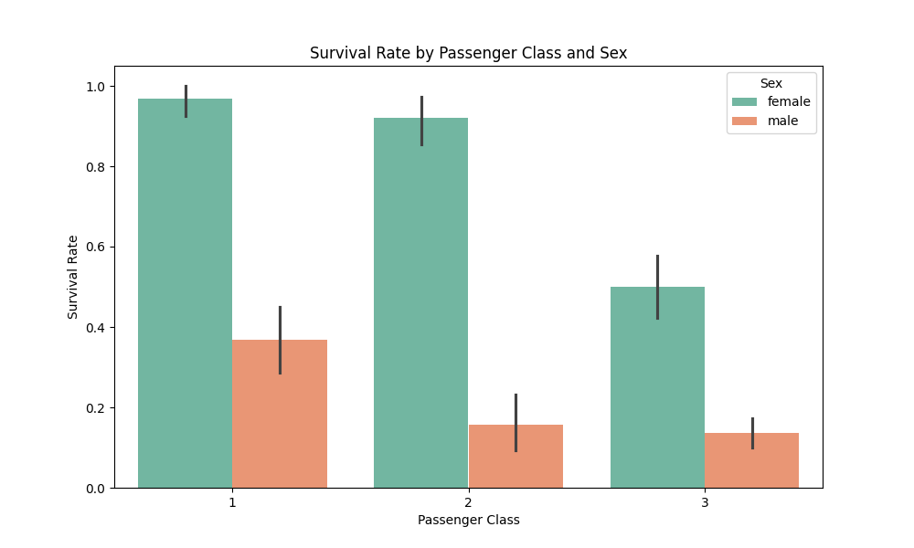
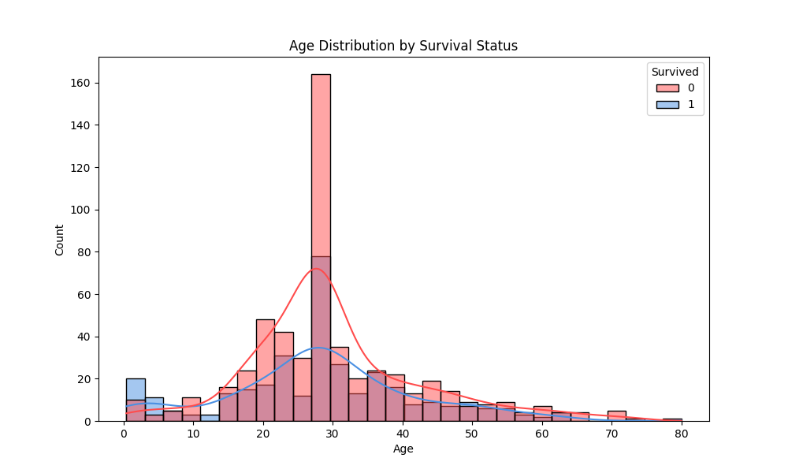

# Titanic Survival Analysis (SCT_DS_2) 🚢


## Overview
This project, completed as part of my internship at **SkillCraft Technology**, analyzes the Titanic dataset to uncover insights into passenger survival patterns. The dataset includes 891 passengers with features like passenger class, sex, age, fare, and more. Using **Exploratory Data Analysis (EDA)**, I explored relationships between these variables and survival rates, visualized key trends, and documented the findings.

The primary goal was to identify factors influencing survival, such as socio-economic status, gender, and age, and present the results in a clear and visually appealing manner.

## Key Insights 📊
- **Overall Survival Rate**: 38.4% of passengers survived (342 out of 891).
- **Survival by Passenger Class (Pclass)**:
  - 1st Class: 63.0% survival rate.
  - 2nd Class: 47.3% survival rate.
  - 3rd Class: 24.2% survival rate.
  - **Trend**: Higher-class passengers had significantly better survival odds, likely due to better access to lifeboats.
- **Survival by Sex**:
  - Females: 74.2% survival rate.
  - Males: 18.9% survival rate.
  - **Trend**: Females had a much higher survival rate, reflecting the "women and children first" protocol.
- **Survival by Age Group**:
  - <16 years: 62.7% survival rate.
  - 16-30 years: 36.8% survival rate.
  - 31-45 years: 32.7% survival rate.
  - 46-60 years: 40.3% survival rate.
  - >60 years: 26.9% survival rate.
  - **Trend**: Children (<16) had a higher survival rate, while the elderly (>60) had lower chances.
- **Survival by Embarkation Port**:
  - Cherbourg (C): 55.4% survival rate.
  - Queenstown (Q): 39.0% survival rate.
  - Southampton (S): 33.9% survival rate.
  - **Trend**: Passengers from Cherbourg had a higher survival rate, possibly due to a higher proportion of 1st-class passengers.

## Visualizations 📈
The following visualizations were created to highlight key trends in the data:

- **Survival Rate by Passenger Class and Sex**: A bar chart showing survival rates across different classes and genders.
- **Age Distribution by Survival Status**: A histogram (with KDE) showing the age distribution of passengers, split by survival status.

## Dataset
The dataset used is `train.csv`, which contains 891 rows and 12 columns:
- **Columns**: `PassengerId`, `Survived`, `Pclass`, `Name`, `Sex`, `Age`, `SibSp`, `Parch`, `Ticket`, `Fare`, `Cabin`, `Embarked`.
- **Key Preprocessing**:
  - Imputed missing `Age` values with the median (28).
  - Imputed missing `Embarked` values with the mode (S).
  - Dropped the `Cabin` column due to 77% missing values.

## Files
- `eda_titanic_display.py`: Python script for EDA and visualization (displays charts on the screen).
- `train.csv`: Titanic dataset.
- `Survival_by_Class_Sex.png`: Bar chart of survival rates by class and sex.
- `Age_Distribution_Survival.png`: Histogram of age distribution by survival status.
- `README.md`: This file.

## Tech Stack 🛠️
- **Python**: For data analysis and visualization.
- **Pandas**: For data manipulation.
- **Matplotlib & Seaborn**: For creating visualizations.
- **Tabulate**: For formatted table output.

## How to Run 🏃‍♂️
1. **Clone the Repository**:
   ```bash
   git clone https://github.com/shubham0915/SCT_DS_2.git
   cd SCT_DS_2
   ```
2. **Install Dependencies**:
   Ensure you have Python 3.8+ installed, then install the required libraries:
   ```bash
   pip install pandas matplotlib seaborn tabulate
   ```
3. **Run the Script**:
   Execute the Python script to perform the EDA and display the visualizations:
   ```bash
   python eda_titanic_display.py
   ```
   - The script will print summary statistics and display two charts on your screen:
     - Survival Rate by Passenger Class and Sex.
     - Age Distribution by Survival Status.

## Screenshots 📸
Below are the visualizations generated during the analysis:

### Survival Rate by Passenger Class and Sex


### Age Distribution by Survival Status


## Acknowledgements 🙏
- **SkillCraft Technology**: For providing this internship opportunity and the task to analyze the Titanic dataset.
- **Kaggle**: For the Titanic dataset.
- **Seaborn & Matplotlib**: For enabling beautiful visualizations.

---

Feel free to explore the project and share your feedback! 🚢
